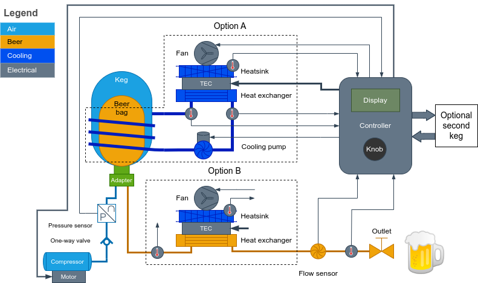

# Portabeer/Beerpak
Portable draft beer in a backpack! Independently chill and tap up to two kegs: it can be used with two different kinds of beer or wine and even for mixing drinks on the fly. Chilling can be achieved by either indirect heat exchange (option A) or inline direct heat exchange (option B). 

General diagram

Electronics diagram

## Features
- Li-ion/Lipo battery + fuel gauge + charger
- [2x] Air pump + pressure sensor
- [2x] Cooling system (Peltier cell/heat pump + fan[s] + water pump)
- Temperature sensors on battery, PCB, cooler (in and out) (4x), heatsink (2x), beer outlet (2x)
- [2x] flow sensor on beer outlet
- User interface (dispaly, encoder, buzzer), remote?, settings memory?

## Parts
- [pressure sensor](https://www.aliexpress.com/item/1005005510454084.html)
- [air pump](https://www.aliexpress.com/item/1005007239975137.html)
- [battery](https://eu.nkon.nl/rechargeable/li-ion/21700-20700-size/samsung-inr21700-50gb.html) ([datasheet](https://www.master-instruments.com.au/file/67273/1/Samsung-INR21700-50G.pdf))

### PCB components
- Microcontroller: RP2040?
- Flash memory: 
- Battery charger: MP24612?
- Battery monitoring: LTC2943?
- ADC: MCP3208?
- Primary regulator (5V): TPS54202
- Secondary regulator (3.3V): 6202?
- PB controller: LTC2954?
- Power path controller: LTC4412?

### MCU peripherals
- 4 ADC int
- 1 SPI controller -> 4 pins
- 1 I2C controller -> 2 pins
- 8 timer out
- 4 timer in
- 9 I/O

Total: 31

#### IO assignment

Notes:
- 

| IO | F1       | F2        | F3       | F4     | F5  | F6   | F7   | F8         | F9            | Usage |
|----|----------|-----------|----------|--------|-----|------|------|------------|---------------|-------|
| 0  | SPI0 RX  | UART0 TX  | I2C0 SDA | PWM0 A | SIO | PIO0 | PIO1 | -          | USB OVCUR DET | .     |
| 1  | SPI0 CSn | UART0 RX  | I2C0 SCL | PWM0 B | SIO | PIO0 | PIO1 | -          | USB VBUS DET  | .     |
| 2  | SPI0 SCK | UART0 CTS | I2C1 SDA | PWM1 A | SIO | PIO0 | PIO1 | -          | USB VBUS EN   | .     |
| 3  | SPI0 TX  | UART0 RTS | I2C1 SCL | PWM1 B | SIO | PIO0 | PIO1 | -          | USB OVCUR DET | .     |
| 4  | SPI0 RX  | UART1 TX  | I2C0 SDA | PWM2 A | SIO | PIO0 | PIO1 | -          | USB VBUS DET  | .     |
| 5  | SPI0 CSn | UART1 RX  | I2C0 SCL | PWM2 B | SIO | PIO0 | PIO1 | -          | USB VBUS EN   | .     |
| 6  | SPI0 SCK | UART1 CTS | I2C1 SDA | PWM3 A | SIO | PIO0 | PIO1 | -          | USB OVCUR DET | .     |
| 7  | SPI0 TX  | UART1 RTS | I2C1 SCL | PWM3 B | SIO | PIO0 | PIO1 | -          | USB VBUS DET  | .     |
| 8  | SPI1 RX  | UART1 TX  | I2C0 SDA | PWM4 A | SIO | PIO0 | PIO1 | -          | USB VBUS EN   | .     |
| 9  | SPI1 CSn | UART1 RX  | I2C0 SCL | PWM4 B | SIO | PIO0 | PIO1 | -          | USB OVCUR DET | .     |
| 10 | SPI1 SCK | UART1 CTS | I2C1 SDA | PWM5 A | SIO | PIO0 | PIO1 | -          | USB VBUS DET  | .     |
| 11 | SPI1 TX  | UART1 RTS | I2C1 SCL | PWM5 B | SIO | PIO0 | PIO1 | -          | USB VBUS EN   | .     |
| 12 | SPI1 RX  | UART0 TX  | I2C0 SDA | PWM6 A | SIO | PIO0 | PIO1 | -          | USB OVCUR DET | .     |
| 13 | SPI1 CSn | UART0 RX  | I2C0 SCL | PWM6 B | SIO | PIO0 | PIO1 | -          | USB VBUS DET  | .     |
| 14 | SPI1 SCK | UART0 CTS | I2C1 SDA | PWM7 A | SIO | PIO0 | PIO1 | -          | USB VBUS EN   | .     |
| 15 | SPI1 TX  | UART0 RTS | I2C1 SCL | PWM7 B | SIO | PIO0 | PIO1 | -          | USB OVCUR DET | .     |
| 16 | SPI0 RX  | UART0 TX  | I2C0 SDA | PWM0 A | SIO | PIO0 | PIO1 | -          | USB VBUS DET  | .     |
| 17 | SPI0 CSn | UART0 RX  | I2C0 SCL | PWM0 B | SIO | PIO0 | PIO1 | -          | USB VBUS EN   | .     |
| 18 | SPI0 SCK | UART0 CTS | I2C1 SDA | PWM1 A | SIO | PIO0 | PIO1 | -          | USB OVCUR DET | .     |
| 19 | SPI0 TX  | UART0 RTS | I2C1 SCL | PWM1 B | SIO | PIO0 | PIO1 | -          | USB VBUS DET  | .     |
| 20 | SPI0 RX  | UART1 TX  | I2C0 SDA | PWM2 A | SIO | PIO0 | PIO1 | CLK GPIN0  | USB VBUS EN   | .     |
| 21 | SPI0 CSn | UART1 RX  | I2C0 SCL | PWM2 B | SIO | PIO0 | PIO1 | CLK GPOUT0 | USB OVCUR DET | .     |
| 22 | SPI0 SCK | UART1 CTS | I2C1 SDA | PWM3 A | SIO | PIO0 | PIO1 | CLK GPIN1  | USB VBUS DET  | .     |
| 23 | SPI0 TX  | UART1 RTS | I2C1 SCL | PWM3 B | SIO | PIO0 | PIO1 | CLK GPOUT1 | USB VBUS EN   | .     |
| 24 | SPI1 RX  | UART1 TX  | I2C0 SDA | PWM4 A | SIO | PIO0 | PIO1 | CLK GPOUT2 | USB OVCUR DET | .     |
| 25 | SPI1 CSn | UART1 RX  | I2C0 SCL | PWM4 B | SIO | PIO0 | PIO1 | CLK GPOUT3 | USB VBUS DET  | .     |
| 26 | SPI1 SCK | UART1 CTS | I2C1 SDA | PWM5 A | SIO | PIO0 | PIO1 | -          | USB VBUS EN   | ADC   |
| 27 | SPI1 TX  | UART1 RTS | I2C1 SCL | PWM5 B | SIO | PIO0 | PIO1 | -          | USB OVCUR DET | ADC   |
| 28 | SPI1 RX  | UART0 TX  | I2C0 SDA | PWM6 A | SIO | PIO0 | PIO1 | -          | USB VBUS DET  | ADC   |
| 29 | SPI1 CSn | UART0 RX  | I2C0 SCL | PWM6 B | SIO | PIO0 | PIO1 | -          | USB VBUS EN   | ADC   |

